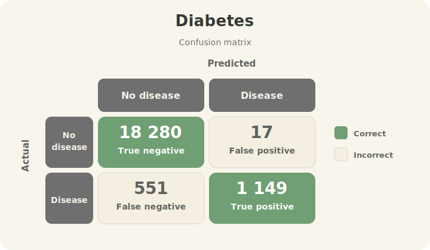
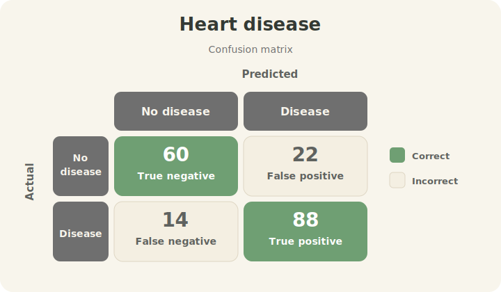

# Dr.Byte - Diseases Classifier App

Dr.Byte is a diagnostic application that combines a React frontend, an ASP.NET Core backend, and Python machine-learning models. System collects patient parameters, validates and normalizes data, passes model-ready features to a FastAPI prediction service, and presents a readable risk report for type II diabetes and heart disease.

> This project is for educational purposes only. It is not a medical device and must not be used for real clinical diagnosis.

## Technology stack

| Layer | Technology | Purpose |
|---|---|---|
| Frontend |     | Patient form, PDF upload flow, risk report UI |
| Backend |  | REST API, data validation, unit normalization, model integration |
| Model service |    | HTTP adapter for persisted ML artifacts |
| Machine learning |     | Preprocessing, pipeline serialization, models training, prediction |
| Runtime |  | One-command local startup for frontend, backend, and model service |

## Features

- Patient form for biometric, metabolic, and cardiovascular parameters;
- PDF upload endpoint for extracting patient parameters;
- Test PDF generator for creating lab reports with selected parameters, units, and values inside or outside reference ranges;
- Backend validation for required fields, numeric ranges, and supported categorical values;
- Unit normalization for values such as weight, height, glucose, cholesterol, and blood pressure;
- Diagnosis report with probability scores and recommendations;
- `Low input completeness` warning when a results are based on a small number of parameters;
- Educational disclaimer visible in an application UI.

## Project structure

```text
diseases_classifier_app/
|-- backend/                  
|   |-- Controllers/           # Diagnosis endpoints
|   |-- Contracts/             # Request/response DTOs
|   |-- Mapping/               # API response mapping
|   |-- ModelClient/           # HTTP client for a model service
|   |-- Parsing/               # PDF parsing, normalization, feature mapping
|   `-- Validation/            # Patient input validation
|-- backend.Tests/            # xUnit tests for backend validation, parsing, and mapping
|-- frontend/                 # React/Vite application
|-- model/                    
|   |-- artifacts/             # joblib models and metrics
|   |-- predict.py             # Prediction entry point
|   `-- train_models.py        # Models training script
|-- docs/                     # Backend notes
|-- tools/rgen/               # Medical lab-report PDF generator
`-- docker-compose.yaml       # Docker configuration
```

## Project running

### Recommended: Docker

Requirements:

- Docker Desktop or a compatible Docker Engine
- Git

Start the full stack:

```powershell
docker compose up --build
```

Available services:

| Service | URL |
|---|---|
| Frontend | `http://localhost:5173` |
| Backend API | `http://localhost:5080` |
| Backend health check | `http://localhost:5080/health` |
| Model service | `http://localhost:8000` |

Stop containers:

```powershell
docker compose down
```

### Development startup

Frontend:

```powershell
cd frontend
npm install
npm run dev
```

Backend:

```powershell
cd backend
dotnet run
```

Model service:

```powershell
pip install -r requirements.txt fastapi uvicorn scikit-learn==1.7.2
python -m uvicorn backend.ModelService.model_api:app --host 0.0.0.0 --port 8000
```

Persisted models artifacts were saved with `scikit-learn==1.7.2`. Please use the same version when loading `.joblib` files locally to avoid pipeline issues.

## Tests

Repository includes an xUnit test project in `backend.Tests`. Tests currently cover:

- `PatientInputValidator` required fields, supported categorical values, and numeric range checks;
- `MedicalUnitNormalizer` conversions for patient metrics and laboratory values;
- `ModelFeatureParser` mapping from normalized patient parameters to model-ready features;
- `DiagnosisMapper` response mapping from model-service output to API responses.

Run the backend tests from the project root:

```powershell
dotnet test backend.Tests
```

## Test PDF generator

The project includes `rgen`, a medical lab-report PDF generator, in `tools/rgen`. It creates test PDFs with parameters used by a diabetes and heart-disease models.

Run it directly from the project root:

```powershell
python -m tools.rgen
```

Useful options:

| Option | Purpose |
|---|---|
| `--output PATH` | Save generated PDF to a specific file |
| `--skip param1 [param2 ...]` | Omit selected parameters |
| `--skipall [param1 ...]` | Omit all parameters except sex and the listed parameters |
| `--exceed N` | Generate values that may be up to `N%` outside reference ranges |
| `--forceexceed N [M]` | Force generate values outside reference ranges |
| `--PARAM -v VALUE -u UNIT` | Set a fixed value and optional unit for one parameter |

For the full command reference, available parameters and aliases, see `tools/rgen/README.md`.

## Models pipelines

The application uses two independent scikit-learn pipelines:

| Model | Dataset | Target | Required features | Optional features |
|---|---|---|---|---|
| Diabetes | `model/diabetes_prediction_dataset.csv` | `diabetes` | `age`, `sex` | `bmi`, `HbA1c_level`, `blood_glucose_level`, `smoking_history` |
| Heart disease | `model/heart_disease_uci.csv` | binary value derived from `num > 0` | `age`, `sex` | `trestbps`, `chol`, `thalch`, `oldpeak`, `ca`, `cp`, `fbs`, `restecg`, `exang`, `slope`, `thal` |

Each model pipeline includes:

- `SimpleImputer` for missing numeric and categorical values,
- `StandardScaler` for numeric features,
- `OneHotEncoder(handle_unknown = "ignore")` for categorical features,
- `MLPClassifier` as the final classifier,
- `joblib` for model artifact persistence.

Prediction flow:

1. The frontend sends form data or a PDF upload to the backend;
2. The backend validates an input and normalizes units;
3. `ModelFeatureParser` maps patient data to feature names expected by the models;
4. The backend sends a request to the FastAPI model service;
5. `model/predict.py` loads the `.joblib` artifacts and returns probabilities and predicted classes;
6. The backend maps model output to a frontend-friendly diagnosis response.

## Models results

Current metrics were calculated on a test split created with `train_test_split(test_size = 0.2, stratify = target, random_state = 137)`.

| Model | Input feature count | Number of test records | Accuracy | Precision | Recall | F1 | ROC AUC |
|---|---:|---:|---:|---:|---:|---:|---:|
| Diabetes | 6 | 19 997 | 0.9716 | 0.9854 | 0.6759 | 0.8018 | 0.9748 |
| Heart disease | 13 | 184 | 0.8098 | 0.8018 | 0.8725 | 0.8357 | 0.8788 |

Features used for the metrics above:

- Diabetes: `age`, `bmi`, `HbA1c_level`, `blood_glucose_level`, `sex`, `smoking_history`.
- Heart disease: `age`, `trestbps`, `chol`, `thalch`, `oldpeak`, `ca`, `sex`, `cp`, `fbs`, `restecg`, `exang`, `slope`, `thal`.

### Confusion matrices

#### Diabetes



#### Heart disease




Additional input-completeness tests showed that the diabetes model is especially dependent on metabolic data. With only `age` and `sex`, the model may still show high accuracy due to class imbalance, but at the default `0.5` threshold it does not reliably detect positive cases. For this reason, the frontend displays a `Low input completeness` warning when a report is based on too few parameters.

## Demo

[](https://drive.google.com/file/d/18aDNnMj4a-uBYWDS9_Fz0i-ZLNRhZA9J/view?usp=drive_link)


## Notes and Limitations

- The frontend confidence indicator is an input-completeness signal, not a probability of diagnosis correctness.
- PDF parsing depends on recognizable labels and document structure.

## Future development

- Add frontend tests for form submission, the `Low input completeness` warning, and report rendering;
- Calibrate and tune decision thresholds for the diabetes model;
- Add model explainability, for example a summary of the most influential features;
- Improve PDF parsing robustness across different templates;
- Pin Python dependencies consistently across local and Docker environments.

## Authors

<table>
  <tr>
    <td align="center">
      <a href="https://github.com/zuzannabrauer">
        
        <br />
        <strong>Zuzanna Brauer</strong>
        <br />
      </a>
    </td>
    <td align="center">
      <a href="https://github.com/thecookedhan">
        
        <br />
        <strong>Maja Chlipała</strong>
        <br />
      </a>
    </td>
    <td align="center">
      <a href="https://github.com/Yerendi-hub">
        
        <br />
        <strong>Konrad Kowalczyk</strong>
        <br />
      </a>
    </td>
  </tr>
</table>
